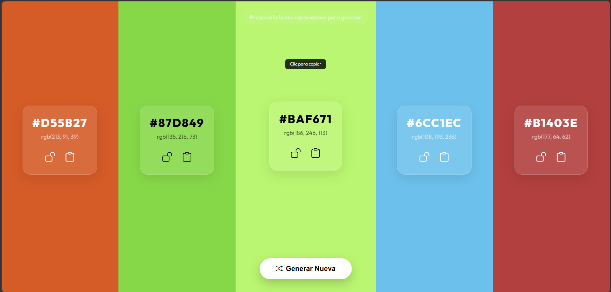

# 🎨 Generador de Paletas de Colores



Una aplicación web moderna y elegante construida con **React** y **Vite** que permite crear paletas de colores armónicas de forma instantánea. Ideal para diseñadores y desarrolladores que buscan inspiración rápida.

## ✨ Características Principales

- **🔄 Generación Aleatoria**: Crea nuevas combinaciones de 5 colores con un solo clic o presionando la **Barra Espaciadora**.
- **🔒 Bloqueo de Colores**: ¿Te gustó un color? Bloquéalo para que permanezca fijo mientras generas el resto de la paleta.
- **📋 Copiado al Portapapeles**: Copia códigos **HEX** o **RGB** instantáneamente haciendo clic sobre ellos o usando el botón dedicado.
- **🌓 Contraste Inteligente**: Los textos cambian automáticamente entre blanco y negro dependiendo del brillo del color de fondo para una legibilidad perfecta.
- **📱 Diseño Responsive**: Experiencia optimizada para escritorio y dispositivos móviles.
- **💎 Estética Premium**: Interfaz con efectos de _glassmorphism_, tipografía moderna (_Outfit_) y micro-animaciones fluidas.

## 🚀 Tecnologías Utilizadas

- **React 19**: Biblioteca principal para la interfaz de usuario.
- **Vite**: Herramienta de construcción ultra rápida.
- **CSS Vanilla**: Estilos personalizados con variables y animaciones avanzadas.
- **Bootstrap Icons**: Set de iconos elegantes y reconocibles.
- **Google Fonts**: Tipografía _Outfit_ para un acabado profesional.

## 🛠️ Instalación y Uso

1. **Clonar/Descargar** el repositorio.
2. Abrir la terminal en la carpeta del proyecto.
3. Instalar las dependencias:
   ```bash
   npm install
   ```
4. Iniciar el servidor de desarrollo:
   ```bash
   npm run dev
   ```
5. Abrir el navegador en `http://localhost:5173`.

## 🎮 Controles

| Acción             | Control                                       |
| :----------------- | :-------------------------------------------- |
| **Generar Paleta** | Tecla `Espacio` o Botón "Generar Nueva"       |
| **Bloquear Color** | Icono de Candado (🔓)                         |
| **Copiar HEX**     | Clic en el código HEX o Icono de Portapapeles |
| **Copiar RGB**     | Clic en el código RGB                         |

---

Desarrollado con ❤️ para facilitar el proceso creativo.
